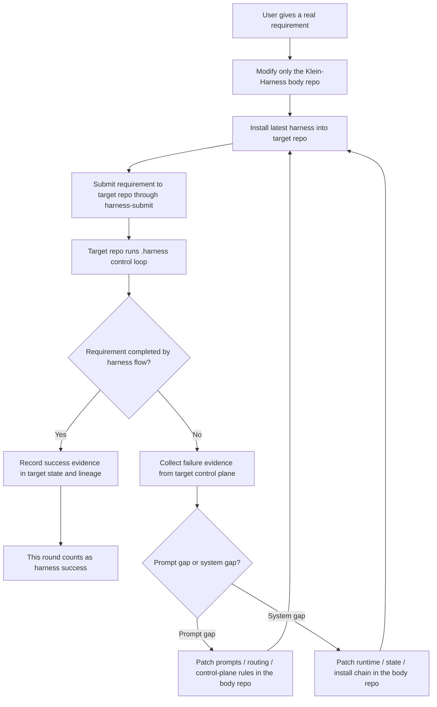

# Phase 1 Validation Loop

## Declaration

Phase 1 uses a strict body-vs-target split.

- `Klein-Harness` is the body project.
- target repos are validation projects.
- body changes happen only in the body repo.
- requirements are submitted to the target project through installed `.harness`.
- if the target project can complete the requirement through the harness flow, this round counts as a harness success.
- if the target project cannot complete the requirement, treat that as a harness gap first, not as a reason to manually rescue the target repo.
- the default operator loop is: patch body -> reinstall into target -> resubmit / rerun target requirement -> inspect control-plane evidence -> decide whether the harness round has converged.

Phase 1 is complete only when a real target requirement can be submitted to the target repo and closed by the harness flow without operator hand-editing the target business code.

## Flow

## Phase 1 Boundaries

- Do not directly modify target business code as the operator.
- Do not treat one-off manual cleanup in the target repo as the final fix.
- Use target repos to expose missing harness capabilities such as worktree cleanup, tmux convergence, topic-drift handling, request binding closure, or guard degradation.
- Each failed target round must be abstracted into a reusable harness capability before the next validation round.

## Convergence Check

A phase-1 round is converged when all of the following are true:

- the target requirement is represented by request/task state in the target repo
- the target control plane can explain what is actionable, blocked, degraded, or completed
- no operator hand-edit of target business code was needed
- remaining blockers, if any, are either genuine target-repo work or an explicit next harness gap
- re-running the same requirement does not recreate the same control-plane bug

## Governance Link

To avoid uncontrolled body-repo inflation during repeated phase-1 loops, apply:

- [harness footprint governance](harness-footprint-governance.md)
- [harness body growth governance](harness-body-growth-governance.md)
- [codebase growth guardrails](codebase-growth-guardrails.md)
