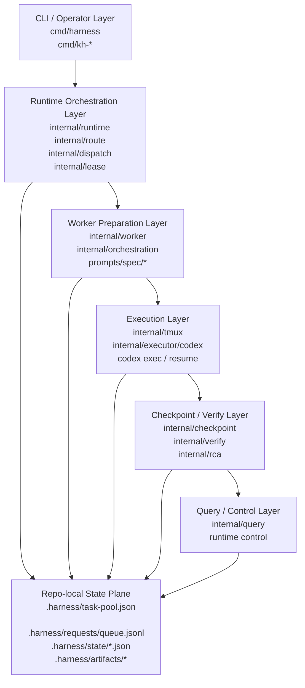
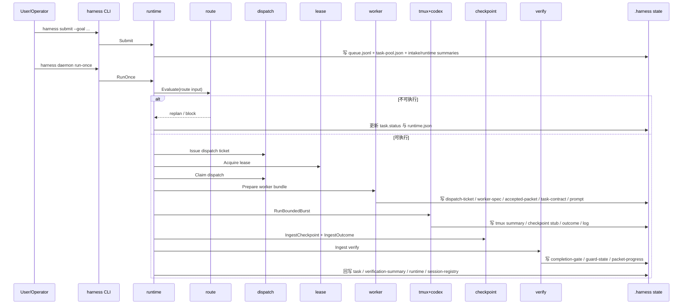

# Klein-Harness 完整架构说明

本文基于当前仓库实现整理，目标是把 `Klein-Harness` 的系统边界、运行时主链路、控制面状态、模块职责、目录分层和验证方式说明清楚，作为当前项目的正式架构说明文档。

适用范围：

- 当前 canonical runtime：`cmd/harness` + `internal/runtime`
- 当前 repo-local control plane：`.harness/`
- 当前兼容入口：`cmd/kh-*` 与 `scripts/harness-*.sh`
- 当前提示词与 packet-synthesis 资产：`prompts/spec/*`

本文不是未来规划草案，而是“以当前代码为准”的结构说明。

## 1. 项目定位

`Klein-Harness` 是一个 repo-local agent runtime。它不是“单条 prompt 驱动”的脚本集合，而是一个把任务、调度、执行、验证、恢复、归档都显式写入仓库本地状态的运行时系统。

核心设计点：

- `harness` 是唯一 canonical CLI
- Go 代码拥有控制面、状态机和执行编排
- `tmux` 只负责会话承载，不负责调度决策
- `codex exec` / `codex exec resume` 只负责模型执行，不负责运行时状态
- 所有关键状态、工件、验证结果都落到仓库内 `.harness/`
- shell 脚本与旧命令仍可用，但只是兼容层，不再是架构中心

一句话概括：

> 这是一个“把 agent runtime 内部状态显式化、可恢复化、可审计化”的本地控制平面系统。

## 2. 架构总览

### 2.1 分层视图



### 2.2 运行时原则

- route-first-dispatch-second：先判断“能不能做”，再生成执行票据
- repo-local state first：状态以仓库内文件为准，而不是会话记忆
- task-local artifact first：执行证据、closeout、verify 都按 task/dispatch 分目录落盘
- completion gate before archive：验证通过不等于可归档，必须先满足完成门禁
- analysis loop on failure：执行失败、验证失败、closeout 不完整时回到 `needs_replan`

## 3. 目录与职责分层

### 3.1 顶层目录

| 目录 | 作用 |
| --- | --- |
| `cmd/` | CLI 入口。`cmd/harness` 是 canonical；`cmd/kh-*` 是兼容入口。 |
| `internal/` | 运行时核心实现，包含任务模型、路由、派发、租约、执行、验证、查询与控制。 |
| `prompts/spec/` | 运行时内置的 orchestration prompt 资产，用于 packet-synthesis、worker-spec、verify 等规范化输出。 |
| `scripts/` | 兼容 shell 包装层与 smoke 脚本。 |
| `skills/` | 安装到 `$CODEX_HOME/skills` 的配套技能，不是 runtime 主逻辑。 |
| `docs/` | 架构、设计、迁移与运行说明文档。 |
| `test/` | demo、真实链路样例和 prompt/test 资产。 |
| `.harness/` | repo-local control plane 的状态目录。 |

### 3.2 `cmd/` 入口层

| 模块 | 作用 | 当前地位 |
| --- | --- | --- |
| `cmd/harness` | canonical CLI，暴露 `init`、`submit`、`tasks`、`task`、`control`、`daemon` 等命令 | 主入口 |
| `cmd/kh-codex` | 兼容型 `codex` 执行入口，内部调用 `internal/codexexec` | 兼容层 |
| `cmd/kh-orchestrator` | 兼容型 orchestrator CLI，可单独做 `route`、`ingest-verification` | 兼容层 |
| `cmd/kh-worker-supervisor` | 兼容型 worker supervisor CLI，可 `claim`、`burst`、`renew-lease` | 兼容层 |

### 3.3 `internal/` 核心模块总表

| 包 | 角色 | 关键职责 |
| --- | --- | --- |
| `internal/adapter` | 仓库适配层 | 统一 `.harness` 路径、任务池读写、session registry 读写、任务工作目录解析。 |
| `internal/a2a` | 事件总线层 | 维护 `.harness/events/a2a.jsonl`，把 route/dispatch/verify 等阶段落成 append-only 事件。 |
| `internal/auth` | 鉴权状态层 | 读取 `$CODEX_HOME/auth.json` 或 `OPENAI_API_KEY`，供 `kh-codex` 使用。 |
| `internal/bootstrap` | 初始化层 | 初始化 `.harness` 的基础目录、空状态文件和默认快照。 |
| `internal/checkpoint` | 检查点层 | 持久化 dispatch 尝试的 checkpoint 和 outcome。 |
| `internal/cli` | CLI 小工具层 | 解析 root 参数。 |
| `internal/codexconfig` | Codex 配置层 | 读取 `$CODEX_HOME/config.toml`，合成 model / approval / sandbox profile。 |
| `internal/codexexec` | 兼容执行层 | 为 `kh-codex` 组装任务、路由、dispatch 与 bounded burst。 |
| `internal/dispatch` | 派发层 | 生成 dispatch ticket、维护幂等索引、claim 执行权。 |
| `internal/executor/codex` | 命令构造层 | 生成 `codex exec` / `codex exec resume` 命令串。 |
| `internal/executor/tmux` | 命令构造层 | 生成 `tmux` 子命令参数。 |
| `internal/instructions` | 指令发现层 | 发现全局、项目和嵌套目录下的 `AGENTS.md` / `AGENTS.override.md`。 |
| `internal/lease` | 租约层 | 给 task/dispatch 分配唯一活跃 lease，防止并发冲突。 |
| `internal/orchestration` | orchestration 资产层 | 定义 packet-synthesis、约束系统、accepted packet、task contract、packet progress。 |
| `internal/query` | 读模型层 | 聚合 task、dispatch、lease、tmux、planning、completion gate 等视图。 |
| `internal/rca` | RCA 分类层 | 将失败分配到 verification_guardrail、routing_session 等 taxonomy。 |
| `internal/route` | 路由判断层 | 判断 dispatch / resume / replan / block。 |
| `internal/runtime` | 核心运行时 | submit、daemon run-once、状态推进、session 绑定、analysis loop。 |
| `internal/state` | CAS 快照层 | 给状态文件提供 revision、metadata 和 compare-and-swap 写入。 |
| `internal/tmux` | 执行承载层 | 创建 tmux session、管道日志、等待退出、汇总会话状态。 |
| `internal/verify` | 验证与 closeout 层 | ingest verify、completion gate、guard state、feedback summary、closeout hook。 |
| `internal/worker` | worker 包装层 | 为一次 dispatch 生成 ticket、worker-spec、prompt、task-contract 等执行包。 |
| `internal/worktree` | 边界守卫层 | 判断是否需要隔离 worktree，校验 changed paths 是否越界。 |

## 4. Canonical 主链路

当前最重要的主链路在 `internal/runtime.RunOnce`，它把一次可执行任务从待处理推进到完成或回流。

### 4.1 时序图



### 4.2 分阶段说明

#### 阶段 A：初始化

入口：`harness init`

由 `internal/bootstrap.Init` 完成，负责：

- 创建 `.harness/` 目录结构
- 初始化 `task-pool.json`
- 初始化 `requests/queue.jsonl`
- 初始化 `state/runtime.json`
- 初始化 `dispatch-summary.json`、`lease-summary.json`、`checkpoint-summary.json`
- 初始化 `verification-summary.json`、`tmux-summary.json`
- 初始化 `completion-gate.json`、`guard-state.json`
- 初始化 `session-registry.json`

这一步定义了 repo-local control plane 的最小状态面。

#### 阶段 B：任务提交

入口：`harness submit`

由 `internal/runtime.Submit` 完成，核心动作：

- 规范化 goal，推断 kind
- 生成 `taskId`、`requestId`
- 根据 canonical goal hash 判断是否复用既有 thread
- 为任务初始化 `ownedPaths`、`forbiddenPaths`、`promptStages`、`dispatch profile`
- 写入 `.harness/task-pool.json`
- 追加写入 `.harness/requests/queue.jsonl`
- 刷新 `intake-summary.json`、`change-summary.json`、`thread-state.json`、`todo-summary.json`
- 更新 `runtime.json`

这里的关键设计不是“直接启动 worker”，而是先把请求和任务绑定进显式状态。

#### 阶段 C：挑选可运行任务

入口：`harness daemon run-once`

由 `internal/runtime.nextRunnableTask` 和 `RunOnce` 驱动：

- 从任务池中挑选状态为 `queued`、`needs_replan`、`recoverable` 的任务
- 把任务临时切到 `routing`
- 读取最新 `planEpoch`
- 读取 checkpoint freshness
- 读取 session registry，判断 resume session 是否被别的任务占用

这一步构造 route input，而不是直接执行。

#### 阶段 D：路由判断

由 `internal/route.Evaluate` 完成。

它会根据这些条件给出 `dispatch`、`resume`、`replan` 或 `block`：

- 当前任务的 `PlanEpoch` 是否过期
- 是否要求先 checkpoint
- 是否有 `worktreePath` 和 `ownedPaths`
- 是否允许 resume
- resume session 是否冲突
- 当前请求是否属于 context enrichment，需要重新规划

同时它会注入 `policy_*` reason codes，例如：

- `policy_bug_rca_first`
- `policy_options_before_plan`
- `policy_resume_state_first`
- `policy_review_if_multi_file_or_high_risk`

这些 reason codes 后续会进入 dispatch ticket、worker-spec、constraint system 和 verify gate，形成“从路由贯穿到验证”的治理链。

#### 阶段 E：dispatch 与 lease

由 `internal/dispatch` 与 `internal/lease` 配合完成。

`dispatch.Issue` 负责：

- 为 task + epoch + attempt 生成唯一 dispatch ticket
- 维护 `IdempotencyIndex`
- 维护 `LatestByTask`
- 在 `ThreadEpochIndex` 中记录 thread + epoch 的最新 dispatch
- 向 `a2a.jsonl` 追加 `dispatch.issued` 事件

`lease.Acquire` 负责：

- 分配活跃 lease
- 保证一个 task / dispatch 只有一个当前 lease
- 记录 `ByTask` 与 `ByDispatch` 反查索引

`dispatch.Claim` 负责：

- 把 dispatch 从 `issued` 推进到 `claimed`
- 绑定 `ClaimedBy` 和 `LeaseID`
- 防止旧 dispatch 覆盖新 dispatch

这一层解决的是控制面“执行权归属”问题，而不是执行细节问题。

#### 阶段 F：worker bundle 准备

由 `internal/worker.Prepare` 完成。

它会在 `.harness/` 下写出一组 task-local 工件：

- `dispatch-ticket-<task>.json`
- `artifacts/<task>/<dispatch>/worker-spec.json`
- `artifacts/<task>/<dispatch>/task-contract.json`
- `state/accepted-packet-<task>.json`
- `state/constraints-<task>.json`
- `state/planning-trace-<task>.md`
- `state/runner-prompt-<task>.md`

它做的事情包括：

- 把 task 和 dispatch 约束翻译成 worker 可执行边界
- 生成 `ConstraintSystem`
- 生成 `HookPlan`
- 生成 `AcceptedPacket`
- 为 packet 中的 execution slices 选出当前 dispatch 对应的 `ExecutionSliceID`
- 将 methodology、judge decision、execution loop、constraint system 注入 dispatch ticket

这一步的意义是把“运行时判断”转成“worker 可执行、可审计、可验证”的执行包。

#### 阶段 G：tmux bounded burst 执行

由 `internal/tmux.RunBoundedBurst` 完成。

它的职责：

- 创建 tmux detached session
- 开启 pane 日志管道
- 生成 runner shell 脚本
- 在 tmux 中执行 `codex exec` 或 `codex exec resume`
- 轮询退出码文件
- 超时后 kill session
- 收集 stdout tail、diff stats、tmux metadata
- 写入 outcome 与 `tmux-summary.json`

这里 `tmux` 只是执行容器，真正的运行时状态推进仍在 Go 侧。

#### 阶段 H：checkpoint / outcome 摄入

由 `internal/checkpoint` 完成。

`IngestCheckpoint`：

- 校验 dispatch 是否仍是当前 dispatch
- 校验 lease 是否仍是当前 lease
- 写入 `checkpoint-summary.json`
- 追加 `worker.checkpoint` A2A 事件

`IngestOutcome`：

- 记录 burst 的 `status`、`summary`、`diffStats`、`artifacts`
- 指出下一步是否建议 `replan`
- 写入 `checkpoint-summary.json`
- 追加 `worker.outcome` A2A 事件

这一层把一次执行尝试变成可追踪的结构化记录。

#### 阶段 I：验证、完成门禁与回流

由 `internal/runtime.deriveVerification` 与 `internal/verify` 共同完成。

验证入口逻辑：

- 如果 burst 已 `failed` / `timed_out`，直接视为失败
- 如果 `verify.json` 缺失，视为失败
- 如果 `verify.json` JSON 非法，视为失败
- 否则从 `verify.json` 提取 status / summary

`verify.Ingest` 的职责：

- 记录 `verification.completed` 事件
- passing 时记录当前 execution slice 已完成
- 刷新 `completion-gate.json`
- 刷新 `guard-state.json`
- 在满足 gate 时追加 `task.completed`
- 在未满足 gate 时发出 `replan.emitted`
- blocked 时发出 `task.blocked`

completion gate 会检查：

- 是否有 passing verification status
- 是否有 summary
- 是否有 verify evidence
- 是否存在 accepted packet
- 是否存在 task contract
- 是否有 verification scorecard
- execution tasks 是否全部完成
- 需要 review 时是否有 review evidence
- hard constraints 是否通过

如果执行失败、验证失败、closeout 缺失或 gate 不满足，runtime 会将任务推进到：

- `needs_replan`
- `blocked`

同时将 promptStages 重置为以 `analysis` 开头，进入下一轮分析闭环。

## 5. `.harness/` 控制面状态设计

### 5.1 状态目录分层

| 路径 | 类型 | 作用 |
| --- | --- | --- |
| `.harness/requests/queue.jsonl` | authoritative | 请求输入队列，append-only。 |
| `.harness/task-pool.json` | authoritative | 任务池，按 `taskId` upsert。 |
| `.harness/state/runtime.json` | authoritative snapshot | 当前 runtime 状态。 |
| `.harness/state/dispatch-summary.json` | authoritative snapshot | dispatch 索引与最新映射。 |
| `.harness/state/lease-summary.json` | authoritative snapshot | lease 活跃状态。 |
| `.harness/state/checkpoint-summary.json` | authoritative snapshot | 每个 task 的最新 checkpoint/outcome。 |
| `.harness/state/verification-summary.json` | authoritative snapshot | 每个 task 的最新验证状态。 |
| `.harness/state/tmux-summary.json` | authoritative snapshot | tmux 会话摘要。 |
| `.harness/state/session-registry.json` | authoritative snapshot | 原生 session 与 task 绑定。 |
| `.harness/state/thread-state.json` | derived operational snapshot | thread 与 planEpoch 追踪。 |
| `.harness/state/intake-summary.json` | derived operational snapshot | 最新 intake 摘要。 |
| `.harness/state/change-summary.json` | derived operational snapshot | 最近一次 change/fusion 摘要。 |
| `.harness/state/todo-summary.json` | derived operational snapshot | 待处理任务摘要。 |
| `.harness/state/completion-gate.json` | derived gating snapshot | 完成门禁。 |
| `.harness/state/guard-state.json` | derived gating snapshot | 可归档守卫状态。 |
| `.harness/state/accepted-packet-*.json` | runtime artifact | 当前 epoch 接受的 packet。 |
| `.harness/state/constraints-*.json` | runtime artifact | 当前任务约束快照。 |
| `.harness/state/planning-trace-*.md` | runtime artifact | B3Ehive packet-synthesis 可见化轨迹。 |
| `.harness/state/runner-prompt-*.md` | runtime artifact | 实际发给 worker 的 prompt。 |
| `.harness/artifacts/<task>/<dispatch>/` | task-local artifact | worker-result、verify、handoff、task-contract 等。 |
| `.harness/checkpoints/<task>/` | attempt artifact | 每次 attempt 的 checkpoint/outcome。 |
| `.harness/events/a2a.jsonl` | event ledger | route / dispatch / verify 等跨节点事件流。 |
| `.harness/feedback-log.jsonl` | learning ledger | outer-loop 失败记忆与反馈事件。 |

### 5.2 为什么状态要分 authoritative 与 derived

authoritative 状态负责“真相落盘”，例如 task-pool、queue、dispatch-summary。

derived 状态负责“查询可读性”和“门禁视图”，例如：

- `todo-summary.json`
- `thread-state.json`
- `completion-gate.json`
- `guard-state.json`

这样做的好处是：

- 写入链路清晰
- 查询成本低
- 可以在控制层直接展示 operator-friendly 视图
- 即使 derived 文件损坏，仍可从 authoritative 层重建

## 6. 模块级详细说明

### 6.1 runtime 核心编排层

核心文件：

- `internal/runtime/model.go`
- `internal/runtime/service.go`
- `internal/runtime/control.go`

职责：

- 定义 request、thread、runtime、verification、tmux 等运行时模型
- 负责 submit、run-once、loop、task 状态推进
- 负责 intake 分类、thread 融合、plan epoch 管理
- 负责会话绑定与 analysis loop 切换
- 负责控制动作：restart、stop、archive

它是当前系统的“总编排器”，其余包大多被它串联调用。

### 6.2 route 路由层

核心文件：

- `internal/route/gate.go`

职责：

- 将 task 当前状态判定为 `dispatch` / `resume` / `replan` / `block`
- 输出 `ReasonCodes`
- 决定 resume session 是否可复用
- 决定 ownedPaths/worktree 缺失是否构成硬阻塞

它本质上是“执行前守门器”。

### 6.3 dispatch 派发层

核心文件：

- `internal/dispatch/service.go`

职责：

- 产生 dispatch ticket
- 维护 dispatch 幂等
- 维护任务当前最新 dispatch
- 防止 stale dispatch 被继续 claim 或覆盖

它解决“这次合法执行尝试到底是哪一次”的问题。

### 6.4 lease 租约层

核心文件：

- `internal/lease/service.go`

职责：

- 保证每个任务/派发只有一个活跃执行租约
- 支持 renew、release、recover stale
- 为 checkpoint/outcome/verify 校验提供执行权依据

它解决“谁当前拥有执行权”的问题。

### 6.5 worker 执行包层

核心文件：

- `internal/worker/manifest.go`

职责：

- 生成 dispatch-ticket、worker-spec、prompt、accepted packet、task contract
- 构造 validation hooks、learning hints、outer-loop memory
- 将 routing policy 和 verification contract 传递给 worker

这是系统里“把控制面翻译成执行合同”的一层。

### 6.6 orchestration 计划资产层

核心文件：

- `internal/orchestration/defaults.go`
- `internal/orchestration/constraints.go`
- `internal/orchestration/runtime_objects.go`

职责：

- 定义 B3Ehive 3 planners + 1 judge 的 packet-synthesis 模型
- 生成 methodology contract、judge decision、execution loop contract
- 生成 layered constraint system
- 定义 accepted packet、task contract、packet progress 等运行时对象

注意：

- 当前 B3Ehive 主要以 metadata 和 planning trace 的形式存在
- 它没有在 runtime 中变成 4 个真实子 dispatch
- 它的产出被 materialize 为 task-local runtime object

### 6.7 tmux 执行承载层

核心文件：

- `internal/tmux/burst.go`
- `internal/tmux/session.go`
- `internal/tmux/summary.go`
- `internal/executor/tmux/command.go`

职责：

- 把 dispatch 变成真实 tmux 会话
- 负责 detached session 生命周期
- 负责日志管道、退出码、超时与 diffStats 收集
- 维护 `tmux-summary.json`

这层不做 route、不做 verify、不做 gate，只承载执行。

### 6.8 Codex 集成层

核心文件：

- `internal/executor/codex/command.go`
- `internal/codexconfig/config.go`
- `internal/auth/store.go`
- `internal/instructions/discovery.go`
- `internal/codexexec/service.go`

职责拆分：

- `executor/codex`：构造 `codex exec` 命令
- `codexconfig`：决定 model / approval / sandbox profile
- `auth`：确认 Codex 当前已认证
- `instructions`：发现需注入的 `AGENTS.md`
- `codexexec`：为兼容入口 `kh-codex` 复用一套 mini runtime

其中 `codexexec` 是兼容路径，不是 canonical path。

### 6.9 checkpoint 与 verify 层

核心文件：

- `internal/checkpoint/service.go`
- `internal/verify/service.go`
- `internal/verify/gate.go`
- `internal/verify/hooks.go`
- `internal/verify/feedback.go`
- `internal/verify/scorecard.go`
- `internal/verify/progress.go`

职责拆分：

- `checkpoint`：写入 checkpoint/outcome 摘要
- `verify/service`：摄入 verify 结果并发出 follow-up event
- `verify/gate`：构建 completion gate 与 guard state
- `verify/hooks`：保证 closeout 完整性，必要时合成缺失 artifact
- `verify/feedback`：记录 outer-loop memory，供后续 replan 使用
- `verify/scorecard`：统一读取 verify assessment/scorecard
- `verify/progress`：记录 execution slice 的完成进度

这是系统里“把执行结果变成可信完成状态”的关键层。

### 6.10 query 与 control 层

核心文件：

- `internal/query/service.go`
- `internal/runtime/control.go`

职责：

- 聚合 task 视图
- 聚合 dispatch、lease、tmux、planning、packet、gate、guard、feedback
- 导出 release board / release snapshot
- 提供 restart、stop、archive 等 operator 动作

`query.Task` 不是简单读 task-pool，它会拼装控制面全景视图。

### 6.11 adapter 与 state 基础设施层

核心文件：

- `internal/adapter/project.go`
- `internal/state/snapshot.go`

职责：

- `adapter`：封装 `.harness` 路径、task pool、session registry、task cwd 等仓库适配能力
- `state`：封装 JSON snapshot 的 metadata、revision 与 CAS 写入

这是所有上层包共享的基础设施层。

### 6.12 a2a、rca、worktree 辅助治理层

核心文件：

- `internal/a2a/store.go`
- `internal/rca/service.go`
- `internal/worktree/guard.go`

职责：

- `a2a`：记录跨阶段事件流，提供幂等 append-only ledger
- `rca`：对失败做基础 taxonomy 分配
- `worktree`：校验是否需要隔离 worktree，校验 changed paths 是否越界

它们不是主链路入口，但承担架构治理和安全边界作用。

## 7. Prompt 与运行时对象的关系

`prompts/spec/*` 不是用户文档，而是 runtime-internal prompt 资产。它们服务于三件事：

- 把 orchestration 输出收敛到统一 schema
- 把 packet-synthesis、worker-spec、dispatch-ticket 的格式固化
- 把 methodology、verify、archive 等行为规则沉入 prompt 层

当前 prompt 体系的关键关系：

- `orchestrator.md` 规定 packet synthesizer 只做 orchestration，不做执行
- `methodology.md` 提供 qiushi-inspired discipline
- `packet.md` / `worker-spec.md` 规定结构化输出契约
- `apply.md` / `verify.md` / `archive.md` 约束执行、验证、归档
- `planner-architecture.md` / `planner-delivery.md` / `planner-risk.md` / `judge.md` 规定 B3Ehive 子单元角色

这些 prompt 不直接推进状态机；真正推进状态机的是 runtime、dispatch、lease、verify。

## 8. 任务、线程、会话、切片四种关键维度

### 8.1 Task

`adapter.Task` 是执行的主实体，负责承载：

- taskId
- threadKey
- kind / roleHint / workerMode
- planEpoch
- ownedPaths / forbiddenPaths
- dispatch profile
- verification 状态
- tmux/session 关联信息

### 8.2 Thread

`threadKey` 把“同一持续目标”的多次 request / task 串起来。

它用于：

- goal 去重与融合
- planEpoch 继承
- context enrichment 触发 replan

### 8.3 Session

session 分两类：

- tmux session：真实终端承载
- native codex session：模型侧 resume 依据

系统通过 `session-registry.json` 显式维护 task 与 native session 绑定，避免多个任务抢占同一 session。

### 8.4 Execution Slice

Accepted Packet 会被拆成多个 execution slice，当前 dispatch 只执行其中一个。

这样做的好处：

- 降低单次 dispatch 范围
- 允许 verify 通过后只标记一个 slice 完成
- 剩余 slice 可继续 replan / re-dispatch

这也是 release board 能显示 `remainingSlices` 的原因。

## 9. 兼容层与 canonical 层的关系

### 9.1 当前 canonical 层

- `cmd/harness`
- `internal/runtime`
- `internal/route`
- `internal/dispatch`
- `internal/lease`
- `internal/worker`
- `internal/tmux`
- `internal/checkpoint`
- `internal/verify`
- `internal/query`

### 9.2 当前兼容层

- `cmd/kh-codex`
- `cmd/kh-orchestrator`
- `cmd/kh-worker-supervisor`
- `scripts/harness-*.sh`

兼容层的作用：

- 为旧命令与历史调用方式保留入口
- 在不破坏外部使用习惯的前提下，转发到 Go runtime

它们不是系统事实来源，不应被当作主架构中心。

## 10. 安装与交付面

安装脚本：`install.sh`

它负责：

- 将 `skills/` 安装到 `$CODEX_HOME/skills`
- 在可用时构建并安装 `harness` 二进制到 `$CODEX_HOME/bin`
- 安装 `scripts/harness-*.sh` 兼容脚本
- 更新 `$CODEX_HOME/AGENTS.md` 的 managed block
- 更新 `$CODEX_HOME/config.toml` 中的 managed Codex profiles

这说明项目除了 runtime 本体外，还同时交付：

- 本地 CLI
- agent skills
- 全局 Codex 配置约定

## 11. 测试与验证体系

### 11.1 单元测试

命令：

```bash
go test ./...
```

覆盖重点：

- route 判断
- dispatch/lease 幂等与冲突控制
- worker bundle 生成
- verify gate 与 hooks
- task/query/control 行为

### 11.2 集成测试

命令：

```bash
go test -tags=integration ./...
```

集成测试验证的真实行为包括：

- init -> submit -> run-once -> completed 的主链路
- burst failure -> `needs_replan`
- resume session 流程
- attach/status/archive 控制动作
- ownedPaths 越界后的回流
- 缺失 verify artifact 时的 hookified replan
- 兼容 wrapper 转发到 Go CLI

### 11.3 真实 smoke

命令：

```bash
KLEIN_REAL_SMOKE=1 bash scripts/smoke/runtime-smoke.sh
KLEIN_REAL_SMOKE=1 bash scripts/smoke/tmux-codex-smoke.sh
```

仓库约定优先真实环境验证，fake/mock 主要用于 integration 测试。

## 12. 当前架构的几个关键特点

### 12.1 这是“状态机驱动”的 agent runtime

真正的系统边界不在 prompt，而在：

- task 状态
- dispatch 状态
- lease 状态
- completion gate
- packet progress

### 12.2 这是“repo-local control plane”

控制面完全落在仓库内，因此具备：

- 可恢复
- 可审计
- 可查询
- 可归档

### 12.3 这是“规划资产内置化”的执行系统

传统 `proposal/specs/design/tasks` 被收敛成：

- accepted packet
- worker spec
- dispatch ticket
- task contract
- planning trace

也就是从“外显流程阶段”转成“runtime-owned object”。

### 12.4 这是“失败回流优先”的闭环系统

系统不会因为 worker 自称完成就结束。失败与不确定都会被写成：

- verify failure
- completion gate open
- feedback summary
- analysis.required
- needs_replan

这保证了 closeout 是结构化的，而不是口头性的。

## 13. 一句话理解每个关键模块

| 模块 | 一句话说明 |
| --- | --- |
| `runtime` | 运行时总控，推进任务状态机。 |
| `route` | 执行前守门，决定 dispatch/resume/replan/block。 |
| `dispatch` | 给一次执行尝试签发合法票据。 |
| `lease` | 给当前执行尝试发放独占执行权。 |
| `worker` | 把控制面翻译成 worker 可执行合同。 |
| `orchestration` | 定义 packet、slice、约束和 planning 资产。 |
| `tmux` | 用真实会话承载 bounded burst。 |
| `checkpoint` | 把一次 burst 写成可恢复的结构化记录。 |
| `verify` | 把“执行结束”升级为“验证可信”或“回流重试”。 |
| `query` | 把分散状态拼成 operator 可读视图。 |
| `adapter` | 统一仓库内路径与 JSON 状态访问。 |
| `state` | 给状态文件提供 CAS 快照写入能力。 |
| `a2a` | 维护 append-only 跨阶段事件流。 |
| `worktree` | 保证改动不越权。 |
| `auth/codexconfig` | 让 Codex 执行环境可配置、可鉴权。 |

## 14. 当前架构结论

当前 `Klein-Harness` 已经不是“脚本调脚本”的原型，而是一套成型的 repo-local runtime。

它的核心完成度体现在：

- 有明确 canonical CLI
- 有显式任务模型和线程模型
- 有 route / dispatch / lease / verify 的完整闭环
- 有 task-local artifacts 与 completion gate
- 有 query/control/operator 视图
- 有 integration tests 覆盖核心链路

如果以后继续演进，这份系统最应该保持不变的核心原则是：

- Go 控制面拥有最终状态真相
- `.harness/` 是唯一 repo-local source of truth
- worker 只能执行，不拥有 runtime 主状态
- completion 必须由 verify gate 判定，而不是由执行器自报

